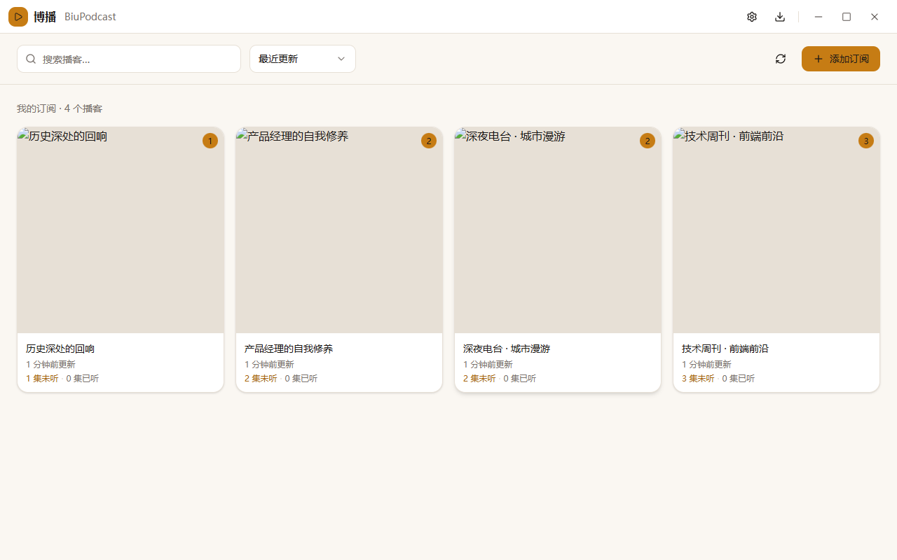
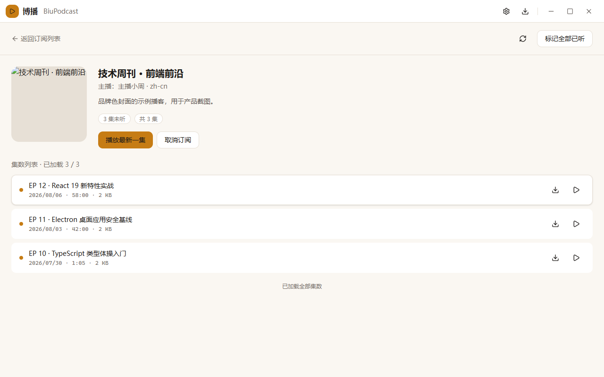

# 博播 BiuPodcast


**博播（BiuPodcast）** 是一款本地优先（Local-first）、离线优先（Offline-first）的桌面播客客户端。所有订阅、播放进度与下载内容都保存在本机，无需账号，数据完全由你掌控。

> 暖琥珀色的设计语言，聚焦"数据在本机、离线可用"的踏实感。数据可完整导出/导入，永不锁死。

## 🖼️ 界面预览





## ✨ 功能特性

- **订阅管理** — 输入 RSS 地址添加订阅，自动解析元数据，检测重复，手动刷新，取消订阅（可选保留数据）
- **播客浏览** — 详情页展示简介/封面/作者，集数列表带已听/未听、已下载/未下载独立状态标识，富文本安全渲染
- **音频播放** — 迷你播放器 + 全屏播放器，播放/暂停/上下集/进度拖拽，播放进度持久化，重启后恢复（不自动出声）
- **离线下载** — 单集下载、并发队列、暂停/继续/取消、断点续传、重启自动恢复、文件完整性校验
- **本地数据** — SQLite 本地存储全部核心数据，`.biubackup` 一键导出/导入（含冲突预览）
- **桌面体验** — 单实例锁定、窗口状态记忆、原生应用菜单、离线状态指示
- **隐私安全** — 渲染进程沙箱/隔离、CSP、HTML 净化，数据不出本机

## 📦 安装

从 [Releases](https://github.com/tagecode/biu-podcast/releases) 下载对应平台的安装包：

| 平台 | 架构 | 格式 |
|------|------|------|
| Windows | x64 | `.exe`（NSIS 安装包） |
| macOS | arm64 | `.dmg` / `.zip`（Apple Silicon） |
| macOS | x64 | `.dmg` / `.zip`（Intel） |
| Linux | x64 | `.AppImage` / `.deb` |

> 安装包目前未签名：macOS 首次打开需在「系统设置 → 隐私与安全性」中允许；Windows 若有 SmartScreen 提示，选择「更多信息 → 仍要运行」。

## 🔨 从源码构建

环境要求：[Node.js](https://nodejs.org/) ≥ 20、[pnpm](https://pnpm.io/) ≥ 10。

```bash
# 安装依赖
pnpm install

# 开发模式（热重载）
pnpm dev

# 运行测试（单元 + 集成 + 覆盖率）
pnpm test
pnpm test:coverage

# 端到端测试（Playwright，驱动打包产物）
pnpm test:e2e

# 构建当前平台安装包
pnpm build:win    # Windows
pnpm build:mac    # macOS
pnpm build:linux  # Linux（AppImage + deb）
```

## 🧪 质量保障

- **三层测试**：单元测试（Vitest + Testing Library）+ 主进程集成测试 + Playwright E2E（冒烟 / 黄金路径 / 续播 / 续传 / 离线播放）
- **覆盖率门禁**：核心业务域语句覆盖率 ≥ 85%（当前 90%+）
- **依赖边界校验**：dependency-cruiser 防止 feature 间越权引用
- **CI 门禁**：`lint → 依赖边界 → typecheck → 单元测试 → 覆盖率 → 构建 → E2E`，三平台安装包自动产出

## 🤝 贡献

欢迎参与贡献！请先阅读 [CONTRIBUTING.md](./CONTRIBUTING.md) 与 [CODE_OF_CONDUCT.md](./CODE_OF_CONDUCT.md)。

开发架构文档见 `mdocs/`：产品需求（[Prd.md](./mdocs/Prd.md)）、技术方案（[Arch.md](./mdocs/Arch.md)）、功能清单（[Feature.md](./mdocs/Feature.md)）、MVP 任务拆解（[Mvp.md](./mdocs/Mvp.md)）、品牌规范（[brand-spec.md](./mdocs/brand-spec.md)）。

## 📄 许可证

[MIT](./LICENSE) © 2026 tagecode
