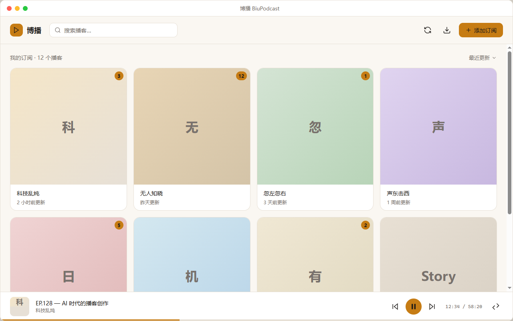
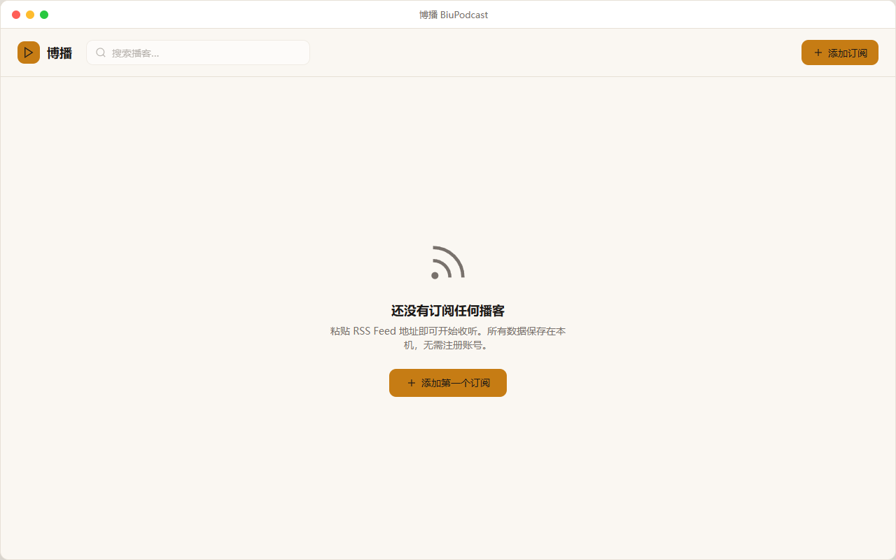
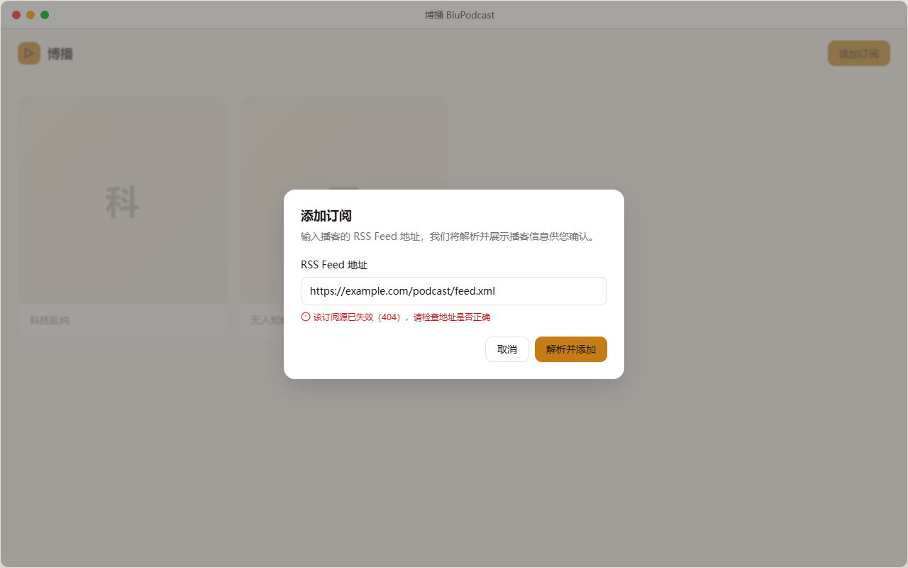
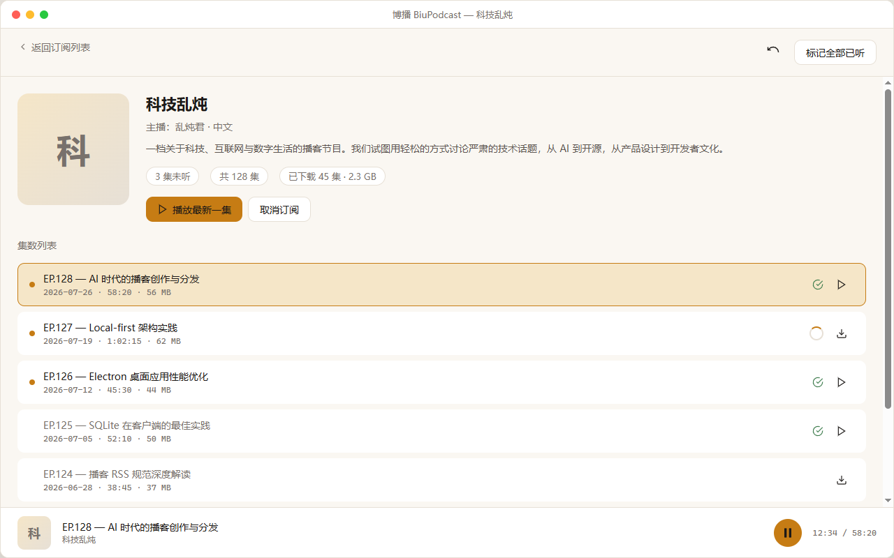
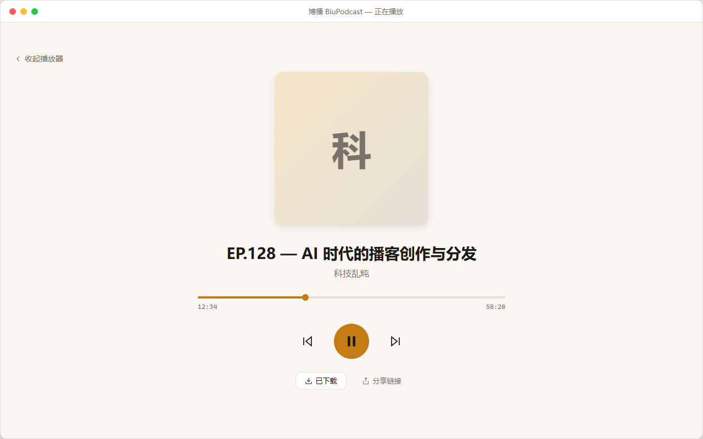
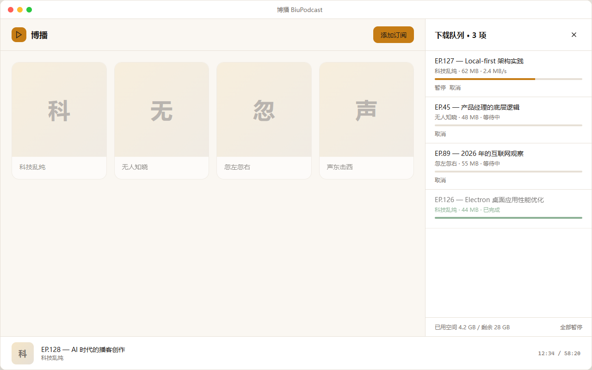
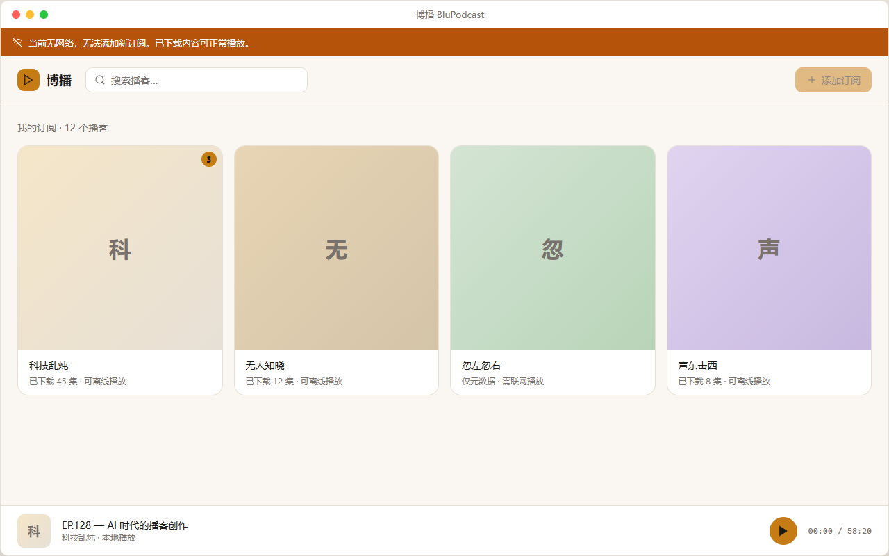
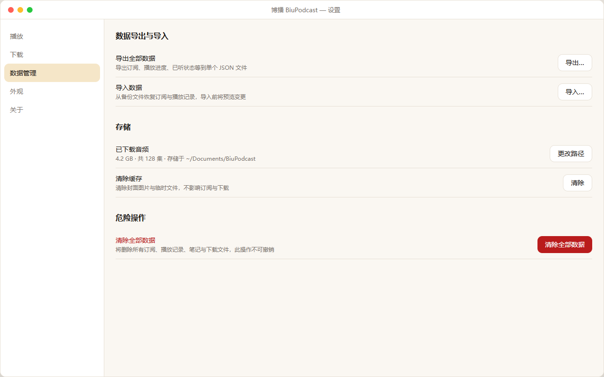
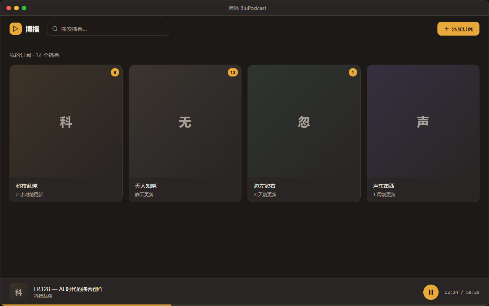

# 博播 BiuPodcast — 主要页面设计稿

| 项目         | 内容                                                                                                               |
| ------------ | ------------------------------------------------------------------------------------------------------------------ |
| 文档版本     | v1.0                                                                                                               |
| 更新日期     | 2026-07-28                                                                                                         |
| 状态         | Draft — 待评审                                                                                                     |
| 关联文档     | [`brand-spec.md`](./brand-spec.md)（视觉规范）、[`Prd.md`](./Prd.md)（功能需求）、[`Mvp.md`](./Mvp.md)（MVP 范围） |
| 窗口基准尺寸 | 1280 × 800 px（桌面 Electron 应用标准窗口）                                                                        |

---

## 1. 设计范围

本文档覆盖 MVP（P0）阶段 **9 个核心界面** 的高保真设计稿，对应 PRD 第 6 章主链路上的关键用户旅程：

| #   | 页面                 | 对应需求                                        | 设计稿                                                       |
| --- | -------------------- | ----------------------------------------------- | ------------------------------------------------------------ |
| 01  | 订阅列表（有内容）   | PRD §6.1 订阅列表排序/搜索                      |    |
| 02  | 空状态（首次启动）   | Mvp T3.6 空状态引导                             |            |
| 03  | 添加订阅弹窗         | PRD §6.1 添加订阅 + Feed 解析失败提示           |     |
| 04  | 播客详情 + 集数列表  | PRD §6.2 播客详情页、集数状态                   |       |
| 05  | 全屏播放器           | PRD §6.3 迷你/全屏播放器切换                    |  |
| 06  | 下载队列面板         | PRD §6.4 下载队列管理                           |       |
| 07  | 离线状态             | PRD §6.1 断网降级 + brand-spec §7.5 离线 Banner |        |
| 08  | 设置 — 数据管理      | PRD §6.5 数据导出/导入 + 清除数据               |            |
| 09  | 深色主题（订阅列表） | brand-spec §2.2 深色主题色板（P1 预留预览）     |           |

> 交互式 HTML 源文件位于 [`design/mockups/`](./design/mockups/) 目录，可在浏览器中直接打开预览或调整细节。

---

## 2. 信息架构

```
博播 BiuPodcast
├── 订阅列表（首页）
│   ├── 搜索 / 排序
│   ├── 添加订阅 → 弹窗
│   ├── 下载队列 → 右侧面板
│   └── 点击播客卡片 → 播客详情
├── 播客详情
│   ├── 播客元信息 + 操作
│   └── 集数列表（已听/已下载状态）
├── 播放器（常驻）
│   ├── 迷你播放器（底部 72px）
│   └── 全屏播放器（展开视图）
├── 设置
│   ├── 播放 / 下载 / 外观
│   └── 数据管理（导出/导入/清除）
└── 全局
    └── 离线 Banner（网络不可用时顶部通栏）
```

---

## 3. 布局规范

### 3.1 窗口结构

```
┌─────────────────────────────────────────────┐
│  标题栏（Electron 原生，40px）                  │
├─────────────────────────────────────────────┤
│  离线 Banner（可选，40px，不可关闭）             │
├─────────────────────────────────────────────┤
│  工具栏（Logo + 搜索 + 操作按钮，~68px）         │
├─────────────────────────────────────────────┤
│                                             │
│  主内容区（可滚动，padding-bottom: 72px）      │
│                                             │
├─────────────────────────────────────────────┤
│  迷你播放器（固定 72px）                        │
└─────────────────────────────────────────────┘
```

### 3.2 关键尺寸

| 元素             | 尺寸                     | 来源                  |
| ---------------- | ------------------------ | --------------------- |
| 窗口基准         | 1280 × 800 px            | PRD §7.4 响应式布局   |
| 内容区左右留白   | 24 px（<960px 时 16 px） | brand-spec §4         |
| 迷你播放器高度   | 72 px                    | brand-spec §4         |
| 离线 Banner 高度 | 40 px                    | brand-spec §7.5       |
| 播客卡片网格     | 4 列，间距 16 px         | 1280px 窗口下最佳密度 |
| 播客详情封面     | 160 × 160 px             | 详情页头部            |
| 全屏播放器封面   | 280 × 280 px             | 播放器展开视图        |
| 下载队列面板宽度 | 360 px                   | 侧滑面板              |

---

## 4. 组件状态说明

### 4.1 集数列表状态（brand-spec §7.3）

设计稿 `04-podcast-detail` 展示了四种组合状态：

| 已听 | 已下载          | 视觉呈现                                | 示例集数         |
| ---- | --------------- | --------------------------------------- | ---------------- |
| 未听 | 已下载          | 8px 琥珀圆点 + 绿色 CheckCircle2        | EP.128、EP.126   |
| 未听 | 未下载 / 下载中 | 圆点 或 环形进度（下载中）              | EP.127（下载中） |
| 已听 | 已下载          | 无圆点 + 绿色 CheckCircle2 + 标题 muted | EP.125           |
| 已听 | 未下载          | 无圆点无图标 + 标题 muted               | EP.124           |
| —    | 下载失败        | AlertCircle 红色                        | EP.123           |

当前播放集数额外高亮：`--amber-100` 背景 + `--amber-600` 边框。

### 4.2 离线降级（brand-spec §1.2）

- 顶部 Banner：`--offline` 背景 + 白色文字 + WifiOff 图标，**不可关闭**
- 「添加订阅」按钮置灰 disabled
- 已下载播客标注「可离线播放」，仅元数据的标注「需联网播放」
- 正在播放已下载内容时，迷你播放器**不展示任何网络提示**

### 4.3 错误提示（brand-spec §7.2）

添加订阅弹窗展示了 URL 解析失败态：

- 输入框边框 `--danger`
- 下方 `--text-xs` 红色文案 + AlertCircle 图标
- 文案遵循「说人话」原则：`该订阅源已失效（404），请检查地址是否正确`

---

## 5. 色彩与字体落地

所有设计稿严格遵循 [`brand-spec.md`](./brand-spec.md) v1.1 定义的令牌：

| 用途        | 浅色 Token    | Hex       |
| ----------- | ------------- | --------- |
| 页面背景    | `--paper`     | `#FAF7F2` |
| 卡片/输入面 | `--surface`   | `#FFFFFF` |
| 主文字      | `--ink`       | `#1C1917` |
| 次要文字    | `--muted`     | `#78716C` |
| 主色 CTA    | `--amber-600` | `#C67C14` |
| 成功/已下载 | `--success`   | `#3F7D4E` |
| 危险/失败   | `--danger`    | `#B91C1C` |
| 离线 Banner | `--offline`   | `#B45309` |

字体：中文 `"PingFang SC"` / `"Microsoft YaHei"`，英文/数字 `"Inter"`，时长等宽 `"SF Mono"`。

---

## 6. 文件清单

```
mdocs/
├── design-mockups.md          ← 本文档（设计稿索引与说明）
└── design/
    ├── export-screenshots.mjs ← PNG 导出脚本
    ├── mockups/               ← 可交互 HTML 源文件
    │   ├── _shared.css        ← 品牌令牌 + 组件样式
    │   ├── 01-subscription-list.html
    │   ├── 02-empty-state.html
    │   ├── 03-add-subscription.html
    │   ├── 04-podcast-detail.html
    │   ├── 05-fullscreen-player.html
    │   ├── 06-download-queue.html
    │   ├── 07-offline-state.html
    │   ├── 08-settings-data.html
    │   └── 09-dark-theme.html
    └── screenshots/           ← PNG 设计稿图
        ├── 01-subscription-list.png
        ├── 02-empty-state.png
        ├── ...
        └── 09-dark-theme.png
```

### 重新导出 PNG

```bash
npx playwright install chromium   # 首次运行需安装浏览器
npx playwright install-deps       # Linux 可选
node mdocs/design/export-screenshots.mjs
```

也可直接在浏览器打开 `mdocs/design/mockups/` 下的 HTML 文件进行交互预览。

---

## 7. 待决事项（设计评审）

| #   | 问题                                 | 建议                                                               | 影响页面 |
| --- | ------------------------------------ | ------------------------------------------------------------------ | -------- |
| 1   | 订阅列表用网格还是单列列表？         | MVP 采用 4 列网格（信息密度高、视觉识别封面），窄窗口下可降为 2 列 | 01       |
| 2   | 下载队列用右侧面板还是独立页面？     | 侧滑面板（360px），不打断当前浏览上下文                            | 06       |
| 3   | 取消订阅入口放在详情页还是右键菜单？ | 详情页次要按钮 + 右键菜单（P1）                                    | 04       |
| 4   | 深色模式 MVP 是否纳入？              | 设计稿已预留（09），实现推迟到 P1                                  | 09       |

---

## 8. 与开发任务的映射

| 设计稿 | MVP 任务 ID                       | 交付物路径（参考）                        |
| ------ | --------------------------------- | ----------------------------------------- |
| 01, 02 | T3.3 订阅列表 UI                  | `src/renderer/src/features/subscription/` |
| 03     | T3.2 添加订阅 Dialog              | 同上                                      |
| 04     | T4.1 播客详情页 + T4.2 集数列表   | `src/renderer/src/features/episode/`      |
| 05     | T5.2 迷你播放器 + T5.3 全屏播放器 | `src/renderer/src/features/playback/`     |
| 06     | T6.4 下载队列面板                 | `src/renderer/src/features/download/`     |
| 07     | T3.5 离线态 UI + T8.x 错误恢复    | 全局 Layout 组件                          |
| 08     | T7.x 数据导出/导入                | `src/renderer/src/features/settings/`     |
| 09     | P1 深色模式                       | `src/renderer/src/assets/main.css`        |
